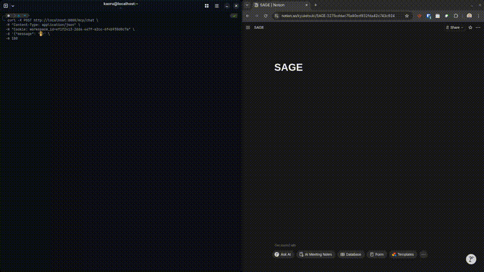

# SAGE — Student Agent for Guided Education
> Your academic co-pilot, built on Notion.



Built for **MLH Global Hack Week — Notion AI Challenge**

---

## What is SAGE?

SAGE is a Notion MCP-powered academic agent for Filipino university students. Tell it your program and year level — it fetches your CHED-verified curriculum from the Ghost Commons registry and builds your entire semester workspace in Notion automatically.

---

## Features

| Feature | Status |
|---|---|
| Semester tree builder | ✅ MVP |
| ADHD micro-breakdown | ✅ MVP |
| Burnout sensor | 🚧 In progress |
| Ghost Commons registry | ✅ MVP |
| Opportunity Sentinel | 📋 Roadmap |
| LMS Chrome extension | 📋 Roadmap |

---

## How it works
```
Student: "I'm a 2nd year BS CpE student, semester 1"
    ↓
SAGE calls get_commons_tree via Notion MCP
    ↓
Fetches CHED CMO-verified curriculum from Ghost Commons
    ↓
Calls create_semester_tree — builds Notion workspace
    ↓
6 course pages, task databases, competency tags — done
```

---

## Tech stack

- **FastAPI** — hosted MCP server + Ghost Commons API
- **Notion MCP** — workspace orchestration
- **Qwen2.5-Coder-32B** via Vultr Serverless Inference
- **Supabase** PostgreSQL — Ghost Commons registry
- **Gaffa** — CMO PDF scraping + extraction
- **Docker + Podman** — containerized deployment

---

## Ghost Commons

A CHED CMO-seeded curriculum registry. When a student's program isn't cached yet, SAGE triggers lazy seeding — Gaffa scrapes the official CMO PDF, extracts structured curriculum data via AI, and loads it automatically.

---

## Setup
```bash
# Clone
git clone https://github.com/kuya-carlo/sage-mcp
cd sage-mcp

# Copy env
cp .env.example .env
# Fill in your keys (see .env.example)

# Run
docker compose up -d
```

### Required env vars

See `.env.example` for full list. Minimum to run:
- `SUPABASE_URL` + `SUPABASE_KEY` + `SUPABASE_DB_URL`
- `NOTION_INTERNAL_TOKEN` + `NOTION_WORKSPACE_ID` + `NOTION_ROOT_PAGE_ID`
- `VULTR_INFERENCE_KEY` + `VULTR_INFERENCE_URL`
- `GAFFA_API_KEY`
- `FERNET_KEY` + `ADMIN_KEY`

---

## Roadmap

- **v1.1** — pgvector semantic search on Ghost Commons
- **v1.2** — Chrome extension LMS bridge
- **v1.3** — Gmail receipt scraper (GCash/Maya burn-rate)
- **v1.5** — Live Opportunity Sentinel (Devpost/MLH)
- **v2.0** — Federated Ghost Commons, Tagalog/English bridges

---

## Built by

**Built by:** kuya-carlo  — BS Computer Engineering student, Bulacan State University

**Solo submission** — MLH Global Hack Week 2026
